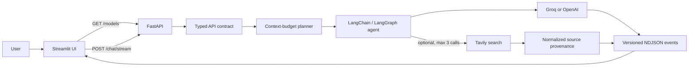

# Agentic Chatbot with FastAPI

[](https://github.com/Ajbil/agentic-chatbot-fastapi/actions/workflows/ci.yml)
[](https://github.com/Ajbil/agentic-chatbot-fastapi/actions/workflows/codeql.yml)
[](https://www.python.org/downloads/)
[](CONTRIBUTING.md)
[](LICENSE)

A typed and tested AI-agent application built with a Streamlit frontend, FastAPI backend, and LangChain/LangGraph orchestration. It supports bounded optional Tavily search, auditable source provenance, deterministic context budgeting, and versioned NDJSON answer streaming across Groq and OpenAI models.

## Engineering highlights

- Backend-owned, typed model and API contracts prevent frontend/provider coupling.
- Deterministic recent-window context selection exposes what was omitted and why.
- Bounded search normalizes untrusted provider output into application-owned provenance.
- Versioned NDJSON events enforce ordering, one terminal outcome, and atomic history commits.
- Versioned AI evaluations distinguish deterministic contract gates from advisory answer-quality signals.
- Offline tests use fake providers; local and CI gates require lint, formatting, static types, branch coverage, deterministic evaluation replay, compilation, and CodeQL analysis.
- The [engineering learning journal](docs/learning/README.md) preserves decisions, alternatives, evidence, and transferable lessons for every checkpoint.

## Architecture



## Technology stack

- Python 3.12
- Streamlit for the user interface
- FastAPI and Uvicorn for the API
- Pydantic for request validation
- LangChain/LangGraph for agent orchestration
- Groq and OpenAI as model providers
- Tavily for optional web search
- Pipenv for dependency and environment management
- Ruff, mypy, pytest, and coverage.py for enforced quality gates
- GitHub Actions, CodeQL, and Dependabot for repository automation

## Prerequisites

- Python 3.12
- Pipenv
- An API key for each service you choose to use

## Local setup

1. Install the dependencies:

   ```powershell
   python -m pipenv sync --dev
   ```

2. Create a local environment file from the template:

   ```powershell
   Copy-Item .env.example .env
   ```

3. Add the keys needed for the features you use. Never commit `.env`:

   - Groq models require `GROQ_API_KEY`.
   - OpenAI models require `OPENAI_API_KEY`.
   - Web search requires `TAVILY_API_KEY`.

4. Start the FastAPI backend:

   ```powershell
   python -m pipenv run python backend.py
   ```

5. In a second terminal, start the Streamlit frontend:

   ```powershell
   python -m pipenv run streamlit run frontend.py
   ```

6. Open the Streamlit URL shown in the terminal. FastAPI's interactive API documentation is available at `http://127.0.0.1:3003/docs` while the backend is running.

## Configuration

Configuration is loaded from environment variables and the local `.env` file.

| Variable | Required when | Default |
|---|---|---|
| `GROQ_API_KEY` | A Groq model is selected | None |
| `OPENAI_API_KEY` | An OpenAI model is selected | None |
| `TAVILY_API_KEY` | Web search is enabled | None |
| `BACKEND_BASE_URL` | Optional frontend override | `http://127.0.0.1:3003` |
| `BACKEND_REQUEST_TIMEOUT_SECONDS` | Optional frontend override | `30` |
| `BACKEND_STREAM_READ_TIMEOUT_SECONDS` | Optional streaming idle-read timeout | `120` |

Settings are validated centrally. Missing credentials fail only when a request uses the corresponding provider or tool.

If you created `.env` before Checkpoint 03, replace `BACKEND_API_URL=http://127.0.0.1:3003/chat` with `BACKEND_BASE_URL=http://127.0.0.1:3003`. The frontend derives both `/models` and `/chat` from that base URL.

## Supported models

The backend owns the model catalog and exposes it through `GET /models`. The Streamlit UI loads this endpoint instead of maintaining its own model constants.

| Provider | Model | Application key | Context window | Output reserve | Tool calling |
|---|---|---|---:|---:|---|
| Groq | GPT-OSS 20B | `groq-gpt-oss-20b` | 131,072 | 4,096 | Yes |
| Groq | GPT-OSS 120B | `groq-gpt-oss-120b` | 131,072 | 4,096 | Yes |
| OpenAI | GPT-4o mini | `openai-gpt-4o-mini` | 128,000 | 4,096 | Yes |

GPT-OSS 20B is the default because it is the lower-cost Groq option in this curated learning catalog. Model availability changes over time, so catalog updates should be reviewed as operational changes.

## Chat API contract

`POST /chat` accepts one canonical request shape. Clients identify a model through the stable application key returned by `GET /models`; provider names and provider-facing model IDs are backend implementation details.

```json
{
  "model_key": "groq-gpt-oss-20b",
  "system_prompt": "Act as a helpful AI Assistant",
  "messages": [
    {
      "role": "user",
      "content": "What is the latest Python release?"
    }
  ],
  "allow_search": true
}
```

A successful request returns HTTP `200` with a typed response:

```json
{
  "model_key": "groq-gpt-oss-20b",
  "reply": "The latest Python release is...",
  "context": {
    "estimation_method": "langchain_approximate_v1",
    "context_window_tokens": 131072,
    "reserved_output_tokens": 4096,
    "safety_margin_tokens": 13108,
    "input_budget_tokens": 113868,
    "estimated_full_input_tokens": 42,
    "estimated_sent_input_tokens": 42,
    "original_message_count": 1,
    "included_message_count": 1,
    "omitted_message_count": 0,
    "was_truncated": false
  },
  "search": {
    "allowed": true,
    "attempted": true,
    "executions": [
      {
        "query": "latest Python release",
        "status": "succeeded",
        "sources": [
          {
            "title": "Python downloads",
            "url": "https://www.python.org/downloads/",
            "snippet": "Download the latest Python release..."
          }
        ]
      }
    ]
  }
}
```

Handled failures return a non-`200` status and a consistent error envelope:

```json
{
  "error": {
    "code": "unsupported_model",
    "message": "Unsupported model key: unknown-model",
    "details": []
  }
}
```

FastAPI's interactive documentation at `http://127.0.0.1:3003/docs` contains the complete request, response, validation, and status-code schemas.

## Streaming chat contract

The Streamlit client sends the same canonical request to `POST /chat/stream`. The backend responds as `application/x-ndjson`: every newline-delimited object is one independently validated version-one event.

```json
{"version":1,"type":"started","sequence":1,"model_key":"groq-gpt-oss-20b"}
{"version":1,"type":"status","sequence":2,"stage":"model_running"}
{"version":1,"type":"delta","sequence":3,"text":"The latest "}
{"version":1,"type":"delta","sequence":4,"text":"release is..."}
{"version":1,"type":"complete","sequence":5,"response":{"model_key":"groq-gpt-oss-20b","reply":"The latest release is...","context":{},"search":{}}}
```

The shortened terminal example omits nested fields for readability; real `complete` events contain the full `ChatResponse`. A stream always starts with `started`, uses contiguous sequence numbers, and ends with exactly one `complete` or `error`. Operational stages describe work such as model execution and web search; they never expose private model reasoning.

Errors detected before streaming begins retain their normal HTTP status and `ErrorResponse`. Once HTTP `200` headers have been sent, a later failure is represented by a terminal `error` event because the server can no longer change the HTTP status.

## Conversation behavior

Streamlit keeps one temporary conversation in each browser session and resends the complete committed history with every request.

- Use the sidebar to choose the model, system prompt, and web-search permission before the first message.
- Conversation settings lock after the first submission so later turns keep the same behavior.
- Successful user and assistant messages are committed together.
- Failed user turns are kept outside model history and can be retried without retyping.
- Use **New chat** to clear history and choose new settings.
- At 50 messages, the UI stops accepting new turns; this remains a structural API limit.
- The UI keeps the full committed transcript even if the backend sends a smaller recent window to the model.
- After each successful turn, the UI displays the estimated model-input usage and warns when older messages were omitted.
- Search evidence remains attached to the assistant turn that produced it.
- When search is allowed, the UI distinguishes unused search, successful retrieval, and failed retrieval.
- Assistant text and safe operational stages appear progressively while the request runs.
- Partial output from a failed stream is labeled incomplete and is never committed to model history.

This history is intentionally session-scoped. It is not stored in a database, shared between browser sessions, or guaranteed to survive a Streamlit restart.

## Context-window policy

The backend calculates an application input budget before constructing a provider client:

```text
input budget = model context window - output reserve - safety margin
```

The output reserve is 4,096 tokens for the current catalog. The safety margin is 10% of the model context window, with a minimum of 256 tokens for small test models. Input size is estimated locally with LangChain's provider-neutral approximation; the estimate is intentionally conservative evidence, not provider billing data.

If the full system prompt and history fit, the backend sends all messages. Otherwise it always retains the newest user message, then prepends the newest complete user/assistant turns while they fit. It never sends half of a completed turn and never skips a recent oversized turn to recover less-relevant older turns. If the system prompt plus newest user message cannot fit, the API returns HTTP `413` with code `context_window_exceeded` before calling a model provider.

The policy does not yet summarize removed history or identify important facts. Search-tool schemas and provider-specific serialization may also consume context; the safety margin reduces that operational risk but does not make the approximation exact.

## Web-search provenance

Enabling web search grants permission; it does not guarantee that the agent will use it. Every successful response therefore reports whether search was allowed, whether it was attempted, which bounded queries ran, whether each execution succeeded, and which normalized sources were retrieved.

One request may perform at most three basic Tavily searches with at most two sources per execution. The application exposes only a validated title, HTTP(S) URL, and bounded snippet. Raw page content, relevance scores, provider exceptions, tool-call identifiers, and other provider metadata stay behind the backend trust boundary.

The UI renders retrieved sources separately from the assistant's Markdown. Source titles and snippets are untrusted web data. A retrieved source is provenance, not a claim-level citation: this checkpoint proves what the search tool returned, but does not yet prove that every sentence in the answer is supported by a source.

## Quality gates

Install the locked development environment, then run the same checks required by pull requests:

```powershell
python -m pipenv sync --dev
python -m pipenv verify
python -m pipenv run ruff check .
python -m pipenv run ruff format --check .
python -m pipenv run mypy
python -m pipenv run python -m evaluations validate
python -m pipenv run python -m evaluations replay --check-baseline
python -m pipenv run python -m pytest --cov=. --cov-report=term-missing --cov-fail-under=80
```

The 166 tests use fake providers and do not make Groq, OpenAI, or Tavily requests. Coverage uses branch measurement, and CI rejects a total below 80%. The separate `evaluation` job validates and replays the committed AI-behavior baseline without credentials. See [CONTRIBUTING.md](CONTRIBUTING.md) for the review workflow and formatting command.

## AI evaluation baseline

The versioned [v1 dataset](evaluations/datasets/v1.json) contains 15 cases covering static knowledge, required and optional search, uncertainty, instruction resilience, multi-turn context, and conflicting evidence. Each case defines deterministic hard invariants and optional lexical signals. Hard checks govern execution, model identity, search permission and usage, provenance counts, and forbidden markers. Advisory checks report concepts and response length; they are useful regression clues but do not prove correctness.

Replay mode scores committed typed `ChatResponse` records and compares the resulting JSON report with the reviewed baseline:

```powershell
python -m pipenv run python -m evaluations validate
python -m pipenv run python -m evaluations replay --check-baseline
```

Live mode sends selected cases through the real FastAPI `GET /models` and `POST /chat` boundary. Start the backend first, then explicitly acknowledge provider usage:

```powershell
python -m pipenv run python -m evaluations live --model-key groq-gpt-oss-20b --confirm-live
```

Live runs are sequential, make no automatic retries, continue after individual failures, and write typed reports under ignored `evaluation-results/`. They are deliberately excluded from CI because model output and external search change over time and may consume paid credits. No LLM judge is used: deterministic rubrics stay explainable, while human review remains necessary for factuality, usefulness, tone, and claim-level grounding.

## Current capabilities

- Choose between supported Groq and OpenAI models.
- Define a custom system prompt.
- Continue a multi-turn conversation through the Streamlit chat interface.
- Optionally allow the agent to search the web using Tavily.
- Retry failed turns without adding incomplete exchanges to model history.
- Bound model input with deterministic recent-window selection and visible usage metadata.
- Inspect whether web search ran and which sources it retrieved for each answer.
- Watch typed model and search progress while the final answer streams.
- Replay a versioned, deterministic AI-behavior baseline and run opt-in live evaluations through the public API.

## Current limitations

This is a portfolio-ready engineering project, not a deployed production service. The evaluation baseline detects contract and search-policy regressions but does not prove factual correctness or real-world model quality. Conversation history remains temporary and browser-session-owned; the project does not yet provide authentication, authorization, persistent storage, deployment infrastructure, rate limiting, production telemetry, service-level objectives, resumable streams, strong cross-provider cancellation, claim-level citation validation, exact provider token accounting, or an explicit custom LangGraph workflow.

## Learning roadmap

Checkpoint 10 establishes the deterministic AI-evaluation baseline. Later checkpoints can add claim-level grounding, an explicit LangGraph workflow, observability, persistence and identity, deployment hardening, and load/resilience testing. These are deliberately separated so this repository does not claim production readiness before it has production evidence.

## Learning journal

The project's plans, decision reasoning, implementation outcomes, and transferable senior-engineering lessons are recorded in [the learning journal](docs/learning/README.md). Each checkpoint is documented before its pull request is merged so the repository preserves both the code and the reasoning behind it.

## Security

- Keep secrets only in `.env` or your deployment platform's secret manager.
- Use `.env.example` to document required variable names without real values.
- If a secret is ever committed, revoke and replace it; deleting it from the latest commit is not sufficient.

## License

This project is available under the [MIT License](LICENSE).
